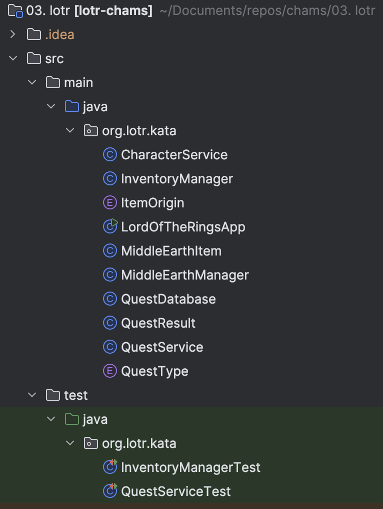

## Workshop ideas
### New code check-list
- [x] `Compile` to validate that we are able to compile/execute the code
- [x] `Analyze potential warnings` during compilation
- [x] `Analyze the code structure` to understand the architecture
  - No architecture...



- [x] Check dependencies to understand potential system interactions
	- No external dependencies
    - Only for tests

```xml
<dependencies>
    <dependency>
        <groupId>org.junit.jupiter</groupId>
        <artifactId>junit-jupiter-api</artifactId>
        <version>${junit.version}</version>
        <scope>test</scope>
    </dependency>
    <dependency>
        <groupId>org.junit.jupiter</groupId>
        <artifactId>junit-jupiter-engine</artifactId>
        <version>${junit.version}</version>
        <scope>test</scope>
    </dependency>
    <dependency>
        <groupId>org.assertj</groupId>
        <artifactId>assertj-core</artifactId>
        <version>3.24.2</version>
        <scope>test</scope>
    </dependency>
    <dependency>
        <groupId>org.mockito</groupId>
        <artifactId>mockito-core</artifactId>
        <version>5.4.0</version>
        <scope>test</scope>
    </dependency>
</dependencies>
```    

  - [x] Run `LibYear` analysis to know dependencies freshness

 ```xml
<plugin>
    <groupId>io.github.mfoo</groupId>
    <artifactId>libyear-maven-plugin</artifactId>
    <version>1.1.0</version>
    <executions>
        <execution>
            <id>libyear-analysis</id>
            <goals>
                <goal>analyze</goal>
            </goals>
        </execution>
    </executions>
</plugin>
 ```


- [ ] Read the `README` / related documentation
- [x] Look at the `git log`

#### Gather metrics
Our tools and development ecosystem allow us to quickly gather metrics to observe the code quality in a fairly factual manner:

Utilisation du plugin [Statistic](https://plugins.jetbrains.com/plugin/4509-statistic).


- [x] Retrieve `code coverage`


- [x] Set up a `static code analysis` tool

Résultat de l'analyse Sonar : https://sonarcloud.io/project/overview?id=ythirion_chams

- [x] Identify `hotspots` (where they are located)

Résultat de l'analyse : https://codescene.io/projects/65318/jobs/3658034/results?scope=month#code-health

- [x] Review the `tests quality` / mutation testing


```xml
<dependency>
    <groupId>org.pitest</groupId>
    <artifactId>pitest-junit5-plugin</artifactId>
    <version>1.2.1</version>
    <scope>test</scope>
</dependency>

<plugin>
    <groupId>org.pitest</groupId>
    <artifactId>pitest-maven</artifactId>
    <version>1.17.1</version>
</plugin>
```

- [ ] (Optional) Detect Linguistic Anti-Patterns with `ArchUnit`

```shell
git log --format=format: --name-only --since=12.month \
 | egrep -v '^$' \
 | sort \
 | uniq -c \
 | sort -nr \
 | head -50
```

### AI actions
Use [Claude Code](https://docs.anthropic.com/en/docs/agents-and-tools/claude-code/overview)?

- **Explain the product**: Which features are covered by the product.
- **Generate Diagram**: Generate mermaid diagrams from code. If no diagram type provided, please ask for the type to the user. Guide him based on the possibilities offered by mermaid (C4, class, sequence, ...)
- **Rate code**: Score code quality
- **Suggest Refactoring**: Suggest improvements for design and structure.
- **Find Bugs**: Analyze code and errors to identify issues.
- **Hints**: Recommend best practices based on the code.
- **Mikado**: Suggest a refactoring strategy using Mikado method based on a specific goal.
- **Split User Stories**: Complex U.S / how to implement
- **Generate missing automated tests**
- **Architecture redesign**